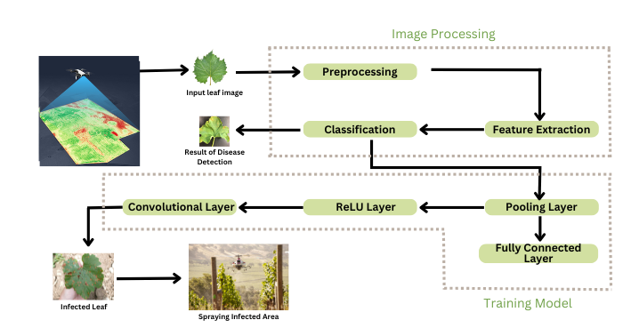

# Drone-Based Crop Disease Detection and Targeted Spraying for Precision Agriculture
## Overview 
This project leverages drone technology and machine learning, particularly Convolutional Neural Networks (CNNs), to detect and analyze crop diseases and pests, providing precise insights for optimized agricultural productivity. By integrating advanced image processing techniques and a robust CNN-based model, the system enables early and accurate identification of crop health issues, minimizing losses and enhancing resource utilization.

## Key Features
### - Convolutional Neural Network (CNN):
Developed a custom CNN architecture optimized for image classification and feature extraction.
Layers include convolutional layers for feature detection, pooling layers for dimensionality reduction, and fully connected layers for classification.
Applied techniques such as data augmentation, dropout, and batch normalization to improve model accuracy and generalization.

###### CNN Architecture

- Input Layer: Accepts preprocessed drone-captured images (e.g., 224x224 RGB).
- Convolutional Layers: Extract hierarchical features such as edges, textures, and shapes using multiple filters.
- Pooling Layers: Perform max-pooling to reduce spatial dimensions while preserving essential features.
- Fully Connected Layers: Process extracted features to output probabilities for disease and pest categories.
- Activation Functions: Used ReLU in hidden layers and Softmax for the output layer.
- Optimization: Trained using Adam optimizer and cross-entropy loss function.

#### - Machine Learning Models:
   Built and compared models using TensorFlow to achieve high accuracy in disease and pest detection.

#### - Image Processing:
   Preprocessed drone-captured images for noise reduction, feature extraction, and segmentation.

#### - Geospatial Mapping:
   Integrated GPS data to map disease occurrences and visualize affected areas.

## Architechture

The diagram illustrates the workflow for detecting crop diseases using drones and a CNN-based machine learning model. It consists of two main stages:

##### Image Processing:

Drones capture images of crops.
These images undergo preprocessing to enhance quality.
Feature extraction identifies patterns in the images, which are then classified to detect diseases.

##### Training Model:

- The Convolutional Neural Network (CNN) processes the input images.
- Convolutional Layers to extract features like edges and textures.
- ReLU Layers to introduce non-linearity.
- Pooling Layers to reduce dimensions while retaining key features.
- Fully Connected Layers for classification results.
Finally, the identified disease areas can be targeted for spraying infected crops, providing a complete solution for agricultural disease management.

   
## Tools & Technologies:
#### - Python Libraries: 
TensorFlow, Pandas, NumPy, Matplotlib
#### - Drone Navigation:
Mission Planner, AeroGCS Green
#### - Data Handling: 
Image preprocessing and geospatial analysis

## Achievements
#### - Smart India Hackathon 2023:
Selected for this national-level innovation platform.
#### - Aavishkar and SNJB Ideation: 
Recognized for its innovative and practical application.

## Impact
This project bridges the gap between technology and agriculture, showcasing the potential of drone-based machine learning solutions in addressing real-world challenges.

